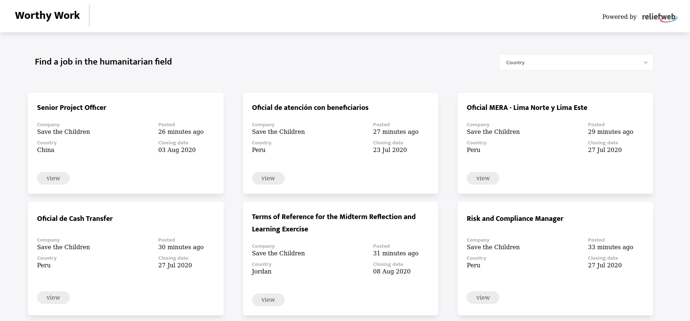

<h1 align="center">
  Worthy Work
</h1>

<h4 align="center"><a href="https://booky-redux.herokuapp.com/">Live version >></a></h4>

## Table of Contents

- [About](https://github.com/bruna-genz/worthy_work/tree/details#built-with)
- [Preview](https://github.com/bruna-genz/worthy_work/tree/details#preview)
- [Built with](https://github.com/bruna-genz/worthy_work/tree/details#built-with)
- [Installation](https://github.com/bruna-genz/worthy_work/tree/details#installation)
- [Testing](https://github.com/bruna-genz/worthy_work/tree/details#testing)
- [Author](https://github.com/bruna-genz/worthy_work/tree/details#author)

## About

This project is a job search web application, focusing on the humanitarian field. It was built with React and Redux and uses the ReliefWeb API to get the information. On the homepage, the user can see the most recent offers and can filter them by country. By clicking in one of the offers, they will be able to see detailed information about it, such as description, application information, and a link to the original offer.

This project is a Capstone from the React course in Microverse's curriculum. The original instructions can be found [here](https://www.notion.so/Catalogue-of-Statistics-72446e7fa33c403a9b6a0bc1de5c6cf5)

## Preview

## Built With

- HTML5; 
- CSS3;
- JavaScript;
- React;
- Redux;
- Webpack;
- Heroku.

## Installation

To install a local version of this app, download or clone the project [here](https://github.com/Luzaks/bookstore-redux.git), then navigate to the project's directory from the terminal and run the following commands:
- `npm i`
- `npm start`

## Testing

To run the tests, use the following command:
- `npm test`

## Author

:woman: **Bruna Genz**

- Github: [@bruna-genz](https://github.com/bruna-genz)
- Twitter: [@Bruna_GK](https://twitter.com/Bruna_GK)
- Linkedin: [Bruna Genz](https://www.linkedin.com/in/brunagenz/)
- Email: brunagenz92@gmail.com